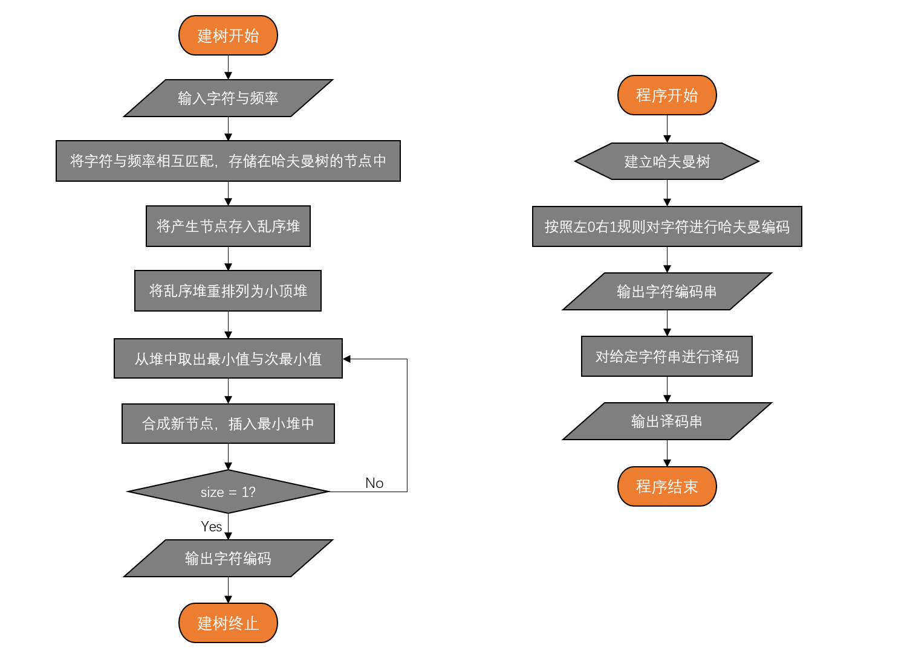
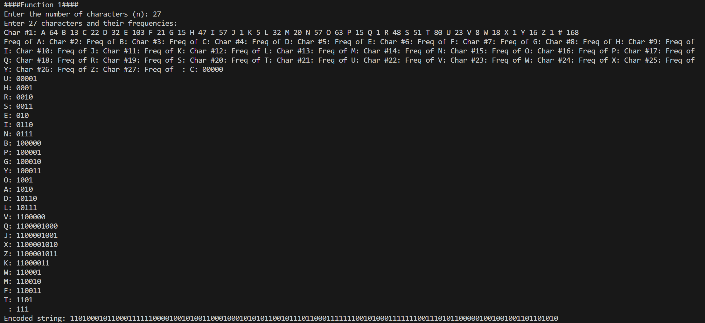
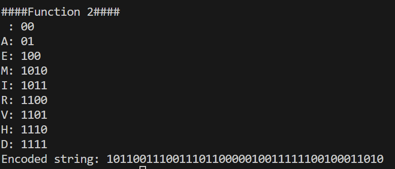
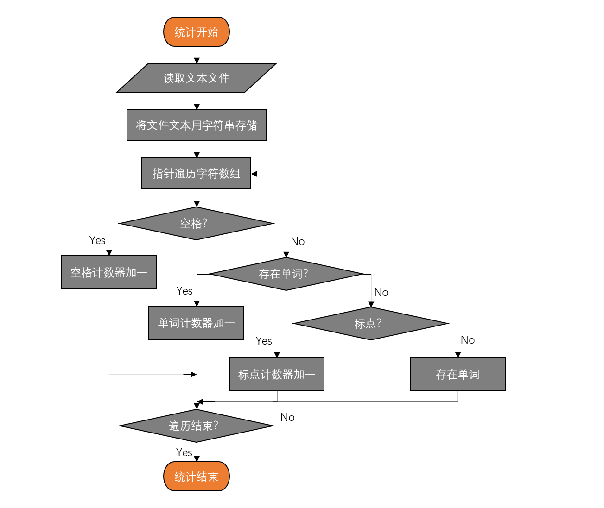
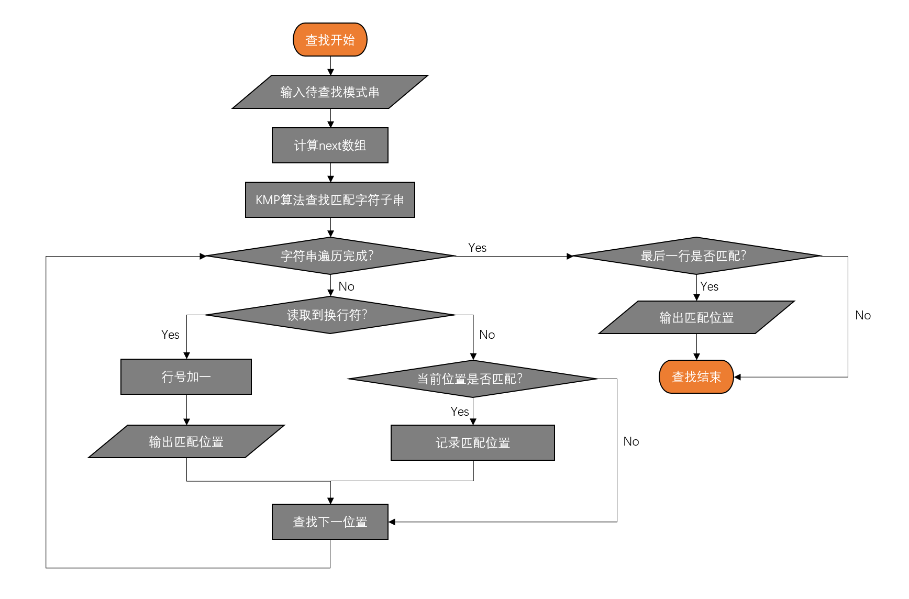
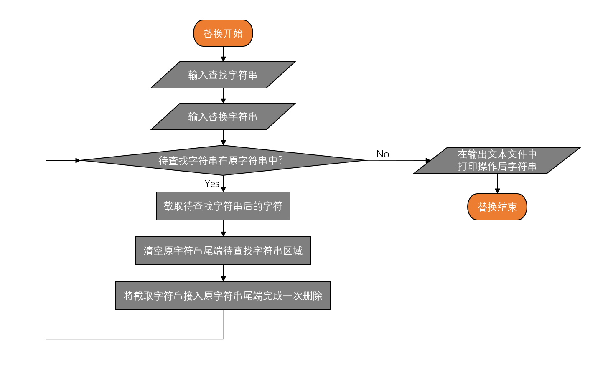

# 上机综合大作业

## 选择的题目
- 题目 13（哈夫曼树的编/译码器模拟）
- 题目 16（串、模式匹配 KMP 算法）

## 题目 13（哈夫曼树的编/译码器模拟）
### 题目功能描述
- 利用哈夫曼编码进行数据的预编码和解码，以模拟实际通信中的数据传输。

### 问题分析与算法设计思路
- 问题分析：哈夫曼编码是一种有效的数据压缩方法，根据字符频率构建最优前缀码，实现数据压缩。这要求我们能够根据给定的字符集及其频率构建哈夫曼树，并据此生成字符的哈夫曼编码。同时，需要提供相应的译码功能，将编码后的数据还原。
- 算法设计思路：
  - 构建哈夫曼树：根据输入的字符及其频率，构建哈夫曼树。
  - 生成哈夫曼编码：遍历哈夫曼树，为每个字符生成其哈夫曼编码。
  - 编码存储：将哈夫曼树及字符编码存储到文件 hfmtree 中。
  - 译码：利用哈夫曼树对编码数据进行译码，还原原始数据。

### 数据结构定义
``` C
// 哈夫曼树节点结构
struct HuffmanTreeNode {
    char data; // 字符
    unsigned freq; // 字符出现的频率
    struct HuffmanTreeNode *left, *right; // 左右子节点
};

// 哈夫曼树结构
struct HuffmanTree {
    unsigned size; // 当前节点数量
    unsigned capacity; // 堆的总容量
    struct HuffmanTreeNode** array; // 指向节点数组的指针
};
```

### 函数定义
1. newNode：
创建一个新的哈夫曼树节点，初始化字符和频率，并将左右子节点指针设为空。
2. createMinHeap：
创建一个最小堆，用于辅助查找最小和次最小频率的节点。
3. swapHuffmanTreeNode：
交换两个哈夫曼树节点的指针。
4. minHeapify：
对最小堆进行维护，确保父节点的频率小于或等于左右子节点的频率。
5. isSizeOne：
检查堆的大小是否为一，即是否所有的节点都被合并到哈夫曼树中。
6. extractMin：
从最小堆中取出并删除根节点，即频率最小的节点。
7. insertMinHeap：
将新节点插入到最小堆中。
8. buildMinHeap：
构建最小堆。
9. isLeaf：
判断节点是否是叶子节点。
10. buildHuffmanTree：
根据给定的字符及其频率构建哈夫曼树。
11. storeCodes：
递归编码并存储哈夫曼编码。
12. printCodes：
打印哈夫曼编码。
13. HuffmanCodes：
构建哈夫曼编码并保存到文件，调用了上述函数。
14. readAndBuildHuffmanTree：
读取字符和频率，构建哈夫曼树，并打印编码。
15. encodeString：
编码一个字符串，根据之前构建的哈夫曼编码表。
16. main：
主函数，调用了 readAndBuildHuffmanTree 和 encodeString。

### 程序流程图


### 源代码
``` C
#include <stdio.h>
#include <stdlib.h>
#include <string.h>

#define MAX_TREE_HT 100

// 哈夫曼树节点结构
struct HuffmanTreeNode {
    char data; // 字符
    unsigned freq; // 字符出现的频率
    struct HuffmanTreeNode *left, *right; // 左右子节点
};

// 哈夫曼树结构
struct HuffmanTree {
    unsigned size; // 当前节点数量
    unsigned capacity; // 堆的总容量
    struct HuffmanTreeNode** array; // 指向节点数组的指针
};

// 创建新的哈夫曼树节点
struct HuffmanTreeNode* newNode(char data, unsigned freq) {
    struct HuffmanTreeNode* temp = (struct HuffmanTreeNode*)malloc(sizeof(struct HuffmanTreeNode));
    temp->data = data;
    temp->freq = freq;
    temp->left = temp->right = NULL;
    return temp;
}

// 创建一个最小堆（辅助查找最小与次最小频率结点）
struct HuffmanTree* createMinHeap(unsigned capacity) {
    struct HuffmanTree* minHeap = (struct HuffmanTree*)malloc(sizeof(struct HuffmanTree));
    minHeap->size = 0;
    minHeap->capacity = capacity;
    minHeap->array = (struct HuffmanTreeNode**)malloc(minHeap->capacity * sizeof(struct HuffmanTreeNode*));
    return minHeap;
}

// 交换两个哈夫曼树节点
void swapHuffmanTreeNode(struct HuffmanTreeNode** a, struct HuffmanTreeNode** b) {
    struct HuffmanTreeNode* t = *a;
    *a = *b;
    *b = t;
}

// 构造最小堆
void minHeapify(struct HuffmanTree* minHeap, int idx) {
    int smallest = idx; //初始化当前下标为idx的节点频率为最小值
    int left = 2 * idx + 1; //左儿子下标
    int right = 2 * idx + 2; //右儿子下标
    
    // 左儿子存在，且左儿子频率小于父节点频率，更新smallest
    if (left < minHeap->size && minHeap->array[left]->freq < minHeap->array[smallest]->freq) {
        smallest = left;
    }

    // 右儿子存在，且右儿子频率小于父节点频率，更新smallest
    if (right < minHeap->size && minHeap->array[right]->freq < minHeap->array[smallest]->freq) {
        smallest = right;
    }

    //若smallest被更新，则说明左右儿子至少一个频率小于父节点，交换父节点与较小频率节点位置
    if (smallest != idx) {
        swapHuffmanTreeNode(&minHeap->array[smallest], &minHeap->array[idx]);
        minHeapify(minHeap, smallest);
    }
}

// 检查堆的大小是否为一，即是否所有的节点都被合并到哈夫曼树中
int isSizeOne(struct HuffmanTree* minHeap) {
    return (minHeap->size == 1);
}

// 从最小堆中取出并删除根节点（频率最小的节点）
struct HuffmanTreeNode* extractMin(struct HuffmanTree* minHeap) {
    struct HuffmanTreeNode* temp = minHeap->array[0];
    minHeap->array[0] = minHeap->array[minHeap->size - 1];
    minHeap->size--;
    minHeapify(minHeap, 0);
    return temp;
}

// 插入一个新节点到最小堆中
void insertMinHeap(struct HuffmanTree* minHeap, struct HuffmanTreeNode* minHeapNode) {
    minHeap->size++;
    int i = minHeap->size - 1;

    //自底向上寻找新节点的插入位置
    while (i && minHeapNode->freq < minHeap->array[(i - 1)/2]->freq) {
        minHeap->array[i] = minHeap->array[(i - 1)/2];
        i = (i - 1)/2;
    }

    minHeap->array[i] = minHeapNode;
}

// 构建最小堆
void buildMinHeap(struct HuffmanTree* minHeap) {
    int n = minHeap->size - 1;
    for (int i = (n - 1) / 2; i >= 0; --i) {
        minHeapify(minHeap, i);
    }
}

// 判断节点是否是叶节点
int isLeaf(struct HuffmanTreeNode* root) {
    return !(root->left) && !(root->right);
}

// 根据给定的字符及其频率构建哈夫曼树
struct HuffmanTree* buildHuffmanTree(char data[], int freq[], int size) {
    struct HuffmanTreeNode *left, *right, *top;

    // 对堆作乱序初始化
    struct HuffmanTree* minHeap = createMinHeap(size);
    for (int i = 0; i < size; ++i) {
        minHeap->array[i] = newNode(data[i], freq[i]);
    }
    minHeap->size = size;
    buildMinHeap(minHeap);

    // 建立哈夫曼树，每次合并最小与次最小频率节点，再将新生成的节点插入最小堆
    while (!isSizeOne(minHeap)) {
        left = extractMin(minHeap);
        right = extractMin(minHeap);

        top = newNode('$', left->freq + right->freq);
        top->left = left;
        top->right = right;

        insertMinHeap(minHeap, top);
    }

    //建树完成后，最小堆仅存储哈夫曼树的根节点
    return minHeap;
}

// 用于存储编码结果
char codes[MAX_TREE_HT][256]; // 增加字符范围以存储所有可能的ASCII字符

// 递归编码并存储
void storeCodes(struct HuffmanTreeNode* root, int arr[], int top) {
    if (root->left) {
        arr[top] = 0;
        storeCodes(root->left, arr, top + 1);
    }

    if (root->right) {
        arr[top] = 1;
        storeCodes(root->right, arr, top + 1);
    }

    if (isLeaf(root)) {
        for (int i = 0; i < top; ++i) {
            codes[root->data][i] = arr[i] + '0'; // 数字转字符
        }
        codes[root->data][top] = '\0'; // 字符串结束符
    }
}

// 打印哈夫曼编码
void printCodes(struct HuffmanTreeNode* root, int arr[], int top) {
    if (root->left) {
        arr[top] = 0;
        printCodes(root->left, arr, top + 1);
    }

    if (root->right) {
        arr[top] = 1;
        printCodes(root->right, arr, top + 1);
    }

    if (isLeaf(root)) {
        printf("%c: ", root->data);
        for (int i = 0; i < top; ++i) {
            printf("%d", arr[i]);
        }
        printf("\n");
    }
}

// 构建哈夫曼编码并保存到文件
void HuffmanCodes(char data[], int freq[], int size) {
    struct HuffmanTree* minHeap = buildHuffmanTree(data, freq, size);
    int arr[MAX_TREE_HT], top = 0;
    storeCodes(minHeap->array[0], arr, top); // 存储编码
    printCodes(minHeap->array[0], arr, top); // 打印编码
}

// 读取字符和频率，构建哈夫曼树并打印编码
void readAndBuildHuffmanTree() {
    int n;
    printf("Enter the number of characters (n): ");
    scanf("%d", &n);
    char* data = (char*)malloc(n * sizeof(char));
    int* freq = (int*)malloc(n * sizeof(int));

    //初始化编码字符与频率
    printf("Enter %d characters and their frequencies:\n", n);
    for (int i = 0; i < n; i++) {
        printf("Char #%d: ", i+1);
        scanf(" %c", &data[i]);
        if (data[i] == '#')
            data[i] = ' ';
        printf("Freq of %c: ", data[i]);
        scanf("%d", &freq[i]);
    }

    HuffmanCodes(data, freq, n);

    free(data);
    free(freq);
}
//从数组中读取字符和频率，构建哈夫曼树并打印编码
void readfromarrayAndBuildHuffmanTree(int* char_freq) {
    int n = 0; //限制字符范围为26个大写字母和空格
    for (int i = 0; i < 256; i ++) {
        if (char_freq[i]) n ++;
    }
    char* data = (char*)malloc(n * sizeof(char));
    int* freq = (int*)malloc(n * sizeof(int));

    //初始化编码字符与频率
    int i = 0;
    for (int j = 0; j < 256; j ++) {
        if (char_freq[j] != 0) {
            if (j >= 'A' && j <= 'Z') {
                data[i] = (char) j;
                freq[i] = char_freq[j];
            } else if (j == '#') {
                data[i] = ' ';
                freq[i] = char_freq[j];
            }
            i ++;
        }
    }
    HuffmanCodes(data, freq, n);

    free(data);
    free(freq);
}
// 编码字符串
void encodeString(char data[], int size) {
    printf("Encoded string: ");
    for (int i = 0; i < size; i++) {
        if (codes[data[i]][0] != '\0') {
            printf("%s", codes[data[i]]);
        } else {
            printf("Error: Character '%c' not found in Huffman Tree.\n", data[i]);
        }
    }
    printf("\n");
}

int main() {
    /* function 1 */
    printf("####Function 1####\n");
    readAndBuildHuffmanTree(); // 读入字符频率，进行哈夫曼编码
    char testStr[] = "THIS PROGRAM IS MY FAVORITE";
    encodeString(testStr, strlen(testStr)); // 编码字符串

    /* function 2 */
    printf("####Function 2####\n");
    int char_freq[256] = {0}; // 初始化ASCII字符频率数组
    FILE *file = fopen("input.txt", "r"); // 打开文件
    if (file == NULL) {
        printf("无法打开文件.\n");
        return 0;
    }
    // 读取文件内容并统计每个字符的频率
    char ch;
    char msg[100]; int size = 0; //存储文件字符串
    while ((ch = fgetc(file)) != EOF) {
        char_freq[(unsigned char) ch]++;
        if (ch != '#') msg[size++] = ch;
        else msg[size++] = ' ';
    }
    msg[size] = '\0';
    fclose(file); // 关闭文件
    readfromarrayAndBuildHuffmanTree(char_freq);
    encodeString(msg, strlen(msg));
    return 0;
}
```

### 含有数据输入/输出的截图
- function1：构造哈夫曼树与译码

- funciton2：统计文本字符，并进行编码译码

输出结果均正确

### 存储结构的优缺点及采用理由
- 存储结构：使用了结构体数组来表示最小堆，结构体来表示哈夫曼树的节点。
  - 优点：
    结构体数组使得节点的管理和访问变得直观且方便。
    方便进行哈夫曼树的构建和最小堆的操作。
  - 缺点：
    静态数组可能限制了数据的规模。
    动态内存分配需要妥善管理，避免内存泄露。
- 采用理由：结构体能够将数据和频率紧密地绑定在一起，便于管理和操作。最小堆是构建哈夫曼树的核心数据结构，有助于快速构建树并进行相关操作。

### 程序错误说明及原因分析
1. 没有想到合适的方法对`' '`进行输入，最后采用`'#'`代表空格。
2. 在解决统计文本并建立哈夫曼树译码问题时，未能解决文本字符的一般性问题，最后选择限制字符范围从'A'到'Z'与空格字符来解决该问题。

### 实验总结
- 最大的困难是构造过程指针的指向改变问题，通过画图，调试解决。
- 通过本次实验，深入理解并实现了哈夫曼树编码过程，提高了变成能力与对指针的理解。

## 题目 16（串、模式匹配 KMP 算法）
### 题目功能描述
- 统计英文文章中单词个数、空格个数和标点符号的个数。
- 统计给定单词在文本中出现的总次数。
- 查找指定的单词，输出其在文本中的行号、在该行中出现的次数以及位置。
- 实现指定词查找并替换为新的单词。
### 问题分析与算法设计思路
- 问题分析：需要对文本进行解析，统计相关信息，并高效地搜索特定模式的字符串。
- 算法设计思路：
  - 文本解析：读取文本并统计单词、空格和标点符号。
  - KMP算法：高效地查找特定单词，利用最长公共前缀数组减少不必要的比较。
  - 单词替换：在找到特定单词后，进行替换操作。
### 数据结构定义
- next数组：用于KMP算法中。

###   函数定义
1. statistics 函数
统计文本中的单词数、空格数和标点符号数。
使用指针遍历文本字符，根据字符的属性进行计数。
输出统计结果。
2. replaceWord 函数
替换文本中的指定单词为新的单词。
使用 strstr 函数找到指定单词的位置。
将文本分为替换位置之前、之后的部分，并插入新单词。
输出替换后的文本到文件。
3. readFile 函数
读取文件内容到字符串。
动态分配内存来存储文件内容。
使用 fgets 逐行读取文件内容，并将其追加到字符串中。
4. writeFile 函数
将字符串写入文件。
打开文件，将字符串写入文件。
5. main 函数
选择性地调用统计、查找和替换功能。
提供用户交互式界面，让用户选择操作。
循环进行操作，直到用户选择退出。
6. KMPSearch 函数：
实现KMP算法，查找指定单词在文本中的位置。

### 程序流程图



### 程序源代码
``` C
#include <stdio.h>
#include <stdlib.h>
#include <string.h>
#include <ctype.h>

#define MAX_BUFFER 10000

// 计算 next 数组
#include <stdio.h>
#include <stdlib.h>
#include <string.h>
#include <ctype.h>

#define MAX_BUFFER 10000

// 计算 next 数组
void computeNextArray(char* pat, int M, int* next) {
    int len = 0;
    next[0] = 0;
    int i = 1;
    while (i < M) {
        if (pat[i] == pat[len]) {
            len++;
            next[i] = len;
            i++;
        }
        else {
            if (len != 0) {
                len = next[len - 1];
            }
            else {
                next[i] = 0;
                i++;
            }
        }
    }
}

// KMP 搜索算法 - 输出模式串出现的行号、该行中出现的次数以及位置
void KMPSearch(char* pat, char* txt) {
    int M = strlen(pat);
    int N = strlen(txt);
    int* next = (int*)malloc(sizeof(int) * M);
    computeNextArray(pat, M, next); //构造next数组

    int i = 0; // txt 的索引
    int j = 0; // pat 的索引
    int line = 1; // 行号
    int count = 0; // 当前行中模式串出现的次数
    int lastNewLine = -1; // 上一个换行符的位置

    while (i < N) {
        if (txt[i] == '\n') {
            line++;
            lastNewLine = i;
            if (count > 0) {
                printf("Line %d: count %d\n", line - 1, count); // 输出上一行的模式串出现次数
                count = 0; // 重置计数器
            }
        }
        if (pat[j] == txt[i]) {
            j++;
            i++;
        }
        if (j == M) {
            printf("行号 %d, 位置 %d\n", line, i - j - lastNewLine);
            j = next[j - 1];
            count++;
        } else if (i < N && pat[j] != txt[i]) {
            if (j != 0) {
                j = next[j - 1];
            } else {
                i++;
            }
        }
    }
    if (count > 0) {
        printf("Line %d: count %d\n", line, count); // 输出最后一行的模式串出现次数
    }
    free(next);
}

// 统计功能：统计文本中的单词、空格和标点符号数量
void statistics(char* txt) {
    int wordCount = 0, spaceCount = 0, punctuationCount = 0;
    char* ptr = txt;
    int inWord = 0;

    while (*ptr) {
        if (isspace((unsigned char)*ptr)) {
            spaceCount++; // 检查是否为空格
            if (inWord) {
                inWord = 0;
                wordCount++;
            }
        }
        else if (ispunct((unsigned char)*ptr)) {
            punctuationCount++; // 检查是否为标点符号
        }
        else {
            inWord = 1; // 若都不是，则判断该位置存在单词
        }
        ptr++;
    }
    if (inWord) {
        wordCount++; // 若存在单词，则计数器加1
    }

    printf("单词数: %d\n空格树: %d\n标点符号数: %d\n", wordCount, spaceCount, punctuationCount);
}

// 替换功能：替换文本中的特定单词
void replaceWord(char* txt, const char* search, const char* replace, FILE* output) {
    char* pos, temp[MAX_BUFFER];
    int index = 0;
    int owlen;

    owlen = strlen(search);
    while ((pos = strstr(txt, search)) != NULL) { //strstr搜索待替换字符串
        strcpy(temp, txt);
        index = pos - txt;
        txt[index] = '\0';
        strcat(txt, replace);
        strcat(txt, temp + index + owlen);
        //截取待替换字符串后的所有字符，清空待替换字符串后再接入截取字符串，完成删除
    }
    fprintf(output, "Replaced text:\n%s\n", txt);
}

// 读取文件内容到字符串
char* readFile(const char* filename) {
    FILE* file = fopen(filename, "r");
    if (!file) {
        perror("Error opening file");
        return NULL;
    }

    char *buffer = (char*)malloc(MAX_BUFFER);
    size_t contentSize = 1; // 包括NULL-terminator
    char *content = (char*)malloc(MAX_BUFFER);
    if(content == NULL){
        perror("Failed to allocate content");
        fclose(file);
        return NULL;
    }
    content[0] = '\0'; // 确保内容为空字符串

    while(fgets(buffer, MAX_BUFFER, file)) {
        char *old = content;
        contentSize += strlen(buffer);
        content = (char*)realloc(content, contentSize);
        if(content == NULL){
            perror("Failed to reallocate content");
            free(old);
            fclose(file);
            return NULL;
        }
        strcat(content, buffer);
    }

    if(ferror(file)) {
        free(content);
        perror("Error reading file");
        fclose(file);
        return NULL;
    }

    fclose(file);
    free(buffer);
    return content;
}

// 写入字符串到文件
void writeFile(const char* filename, const char* data) {
    FILE* file = fopen(filename, "w");
    if (file == NULL) {
        perror("Error opening file");
        return;
    }
    fputs(data, file);
    fclose(file);
}

int main() {
    char* inputFilename = "in.txt";
    char* outputFilename = "out.txt";
    char* text = readFile(inputFilename);
    if (text == NULL) {
        return 1;
    }

    FILE* output = fopen(outputFilename, "w");
    if (output == NULL) {
        perror("Error opening output file");
        free(text);
        return 1;
    }

    // 循环选择操作
    int choice;
    char pat[100];
    char replace[100];
    do {
        printf("选择操作：\n1. 统计\n2. 查找\n3. 替换\n0. 退出\n");
        scanf("%d", &choice);
        switch (choice) {
            case 1:
                statistics(text);
                break;
            case 2:
                printf("输入查找模式串：");
                scanf("%s", pat);
                KMPSearch(pat, text);
                break;
            case 3:
                printf("输入查找单词：");
                scanf("%s", pat);
                printf("输入替换单词：");
                scanf("%s", replace);
                replaceWord(text, pat, replace, output);
                writeFile(inputFilename, text); // 将替换后的文本写回文件
                break;
            case 0:
                printf("退出...\n");
                break;
            default:
                printf("无效选择，请重新输入。\n");
        }
    } while (choice != 0);

    free(text);
    fclose(output);
    return 0;
}
```
### 含有数据输入/输出的截图
- 统计

- 查找

- 替换

- 替换后查找

使用IDE的字符查找功能，输出结果均正确。

### 存储结构的优缺点及采用理由
- 存储结构：使用了数组来表示next数组。
  - 优点：
  数组的查找和构造方便，不占用多余空间。
  - 缺点：
  数组的插入和删除较不方便。
- 采用理由：输入子串后next数组的大小也固定了，使用数组方便查找，节省空间。

### 实验总结
- 最大的困难是KMP算法的匹配过程，需要严密的逻辑，通过大量的调试与画图模拟后完成题目要求。
- 通过本次实验，深入理解并实现了KMP算法，提高了对文本处理的能力。